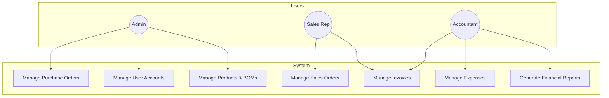

# ERP Application Project Report: Ajyad Accountant

---

## 1. Introduction

**Purpose and Goals**

The Ajyad Accountant ERP system is a comprehensive, desktop-based application designed to meet the core operational needs of small to medium-sized businesses (SMBs). The primary goal of the project is to provide an integrated, intuitive, and cost-effective solution that centralizes business management processes.

The system aims to:
-   **Streamline Operations:** Automate and connect key business functions such as accounting, sales, and inventory management to reduce manual data entry and improve efficiency.
-   **Provide Financial Clarity:** Offer a robust double-entry accounting system with real-time financial reporting to enable better decision-making.
-   **Enhance Security and Control:** Implement role-based access control (RBAC) and detailed audit trails to ensure data integrity and security.
-   **Support Bilingual Operations:** Provide full support for both English and Arabic, including Right-to-Left (RTL) layouts, to cater to a diverse user base.

---

## 2. Core Modules and Features

The application is built on a modular architecture, with each module handling a specific business function.

### 2.1. Accounting
-   **Double-Entry System:** Utilizes `Account`, `JournalEntry`, and `Transaction` models to ensure balanced and accurate bookkeeping.
-   **Chart of Accounts:** Allows for the creation and management of a flexible chart of accounts (Assets, Liabilities, Equity, Revenue, Expense).
-   **Automated Journal Entries:** Key business events, such as creating a sales order or recording an expense, automatically generate the corresponding journal entries.
-   **Financial Reporting:** Core financial statements, including the Profit & Loss statement and the Balance Sheet, are generated by the system.

### 2.2. Inventory Management
-   **Product Catalog:** Manages a detailed list of products, including descriptions, pricing, and categories.
-   **Stock Tracking:** Real-time tracking of `stock_quantity` for each product.
-   **Inventory Movements:** All changes to stock levels are recorded in an `InventoryMovement` log, detailing the reason for the change (e.g., Sale, Purchase, Manual Adjustment).
-   **Low Stock Alerts:** Products can be configured with a `low_stock_threshold` to help managers proactively reorder inventory.

### 2.3. Sales
-   **Sales Order Management:** Full CRUD (Create, Read, Update, Delete) functionality for sales orders.
-   **Inventory Integration:** Creating a sales order automatically deducts the item quantities from the inventory.
-   **Accounting Integration:** Each sales order automatically generates a journal entry, debiting 'Accounts Receivable' and crediting 'Sales Revenue'.

### 2.4. Purchasing
-   **Purchase Order Management:** Enables the creation and tracking of purchase orders sent to suppliers.
-   **Goods Receipt:** A dedicated function (`receive_purchase_order`) allows users to mark an order as received, which automatically increases the stock levels of the ordered products.

### 2.5. Invoicing
-   **Invoice Generation:** Invoices can be created directly from existing sales orders, ensuring data consistency.
-   **Status Tracking:** Invoices are tracked with a status (e.g., `DRAFT`, `SENT`, `PAID`), allowing for a clear view of the billing cycle.

### 2.6. Manufacturing
-   **Bill of Materials (BOM):** The system allows for the creation and management of Bills of Materials, defining the component products required to manufacture a finished good.
-   *(Note: The current functionality is limited to defining BOMs; it does not include a production module to consume components and produce finished goods.)*

### 2.7. Human Resources (HR)
-   **Employee Records:** A foundational module for managing basic employee information through the `Employee` model.

---

## 3. Advanced and Technical Features

-   **Security:**
    -   **Role-Based Access Control (RBAC):** A security decorator (`@requires_roles`) restricts access to specific functions based on user roles (`ADMIN`, `ACCOUNTANT`, `SALES`).
    -   **Password Hashing:** User passwords are securely hashed using `bcrypt`.
    -   **Audit Trail:** An `AuditService` logs all critical user actions (e.g., creating a sale, deleting a BOM) for accountability and review.

-   **Multi-Language Support:** The application is designed to be fully bilingual (English/Arabic), leveraging PyQt's translation system and supporting RTL layouts for Arabic.

-   **Data Integrity:** The use of a relational database with an ORM (SQLAlchemy) enforces data integrity through foreign key constraints and relationships. The system also ensures that all financial transactions are balanced.

-   **Customization:** User-level settings, such as language preference, can be managed through a dedicated configuration service.

---

## 4. System Architecture

The application follows a classic 3-tier architecture, promoting a clean separation of concerns.

```mermaid
graph TD
    A[Presentation Layer (UI)<br>PyQt6 Widgets<br>app/ui] --> B{Business Logic Layer<br>Core Services<br>app/core};
    B --> C[Data Layer<br>SQLAlchemy ORM<br>app/database];
    C --> D[(Database<br>SQLite)];

    subgraph User Interaction
        A
    end

    subgraph Business Rules
        B
    end

    subgraph Data Storage
        C
        D
    end
```

-   **Presentation Layer (Client-Side):**
    -   A desktop graphical user interface (GUI) built with the **PyQt6** framework.
    -   This layer is responsible for all user interaction and is located in the `app/ui` directory.

-   **Business Logic Layer (Server-Side):**
    -   A set of core service modules (`app/core`) that contain all the business rules, logic, and validations.
    -   Examples include `sales_service`, `accounting_service`, and `product_service`. These services orchestrate the interactions between the UI and the database.

-   **Data Layer (Database):**
    -   The **SQLAlchemy ORM** is used to map Python objects to database tables.
    -   The default database is **SQLite**, which is ideal for a self-contained desktop application. The use of SQLAlchemy allows for easy migration to a more powerful client-server database like PostgreSQL if needed.
    -   Database models and session management are located in the `app/database` directory.

---

## 5. Use Cases



1.  **Sales Workflow:** A sales representative logs in, and the system restricts their access to sales-related modules. They create a new sales order for a customer, adding several products. Upon saving, the system automatically reduces the stock for those products and creates a balanced journal entry in the accounting ledger.
2.  **Procurement Workflow:** A manager notices a low stock alert. They create a purchase order for the required items from a registered supplier. When the shipment arrives, they mark the purchase order as "Received," and the system automatically updates the stock quantities.
3.  **Financial Closing:** At the end of the month, an accountant logs in. The system grants them access to the reporting module. They generate a Profit & Loss statement for the period, which aggregates all revenue and expense transactions to calculate the net profit.

---

## 6. Business Intelligence and Reporting

The `reporting_service` provides several key reports for business analysis:
-   **Profit & Loss Statement:** Shows total revenues, expenses, and net profit for a selected date range.
-   **Balance Sheet:** Provides a snapshot of the company's assets, liabilities, and equity.
-   **Sales Report:** Details which products have been sold, in what quantity, and the total revenue generated per product.
-   **Inventory Report:** Lists the current stock quantity and low-stock threshold for all products.

---

## 7. Technology Stack

-   **Programming Language:** Python
-   **Framework (GUI):** PyQt6
-   **Database:** SQLite (default), with SQLAlchemy ORM
-   **Key Libraries:**
    -   `bcrypt`: For secure password hashing.
    -   `reportlab`: For PDF generation (used in the export service).
    -   `openpyxl`: For Excel generation (used in the export service).

---

## 8. Deployment and Scalability

-   **Deployment:** The application is deployed as an on-premise, standalone desktop application. A packaging script (`package.sh`) is included, which uses `pyinstaller` to create distributable executables for different operating systems.
-   **Scalability:** The current architecture is designed for single-user or small-team environments. While the database backend can be scaled by switching from SQLite to a server-based SQL database, scaling the application for a large number of concurrent users would require a transition to a client-server web architecture.

---

## 9. Conclusion

The Ajyad Accountant ERP project successfully provides a centralized and powerful platform for small businesses to manage their core operations. Its key benefits include process automation, enhanced data security, financial accuracy through a double-entry accounting system, and bilingual support.

**Potential Future Enhancements:**
-   **Web-Based Client:** Developing a client-server web application to enable cloud accessibility and support a larger user base.
-   **New Modules:** Adding new modules for Point of Sale (POS), Restaurants, or more advanced CRM functionalities.
-   **Advanced BI:** Integrating more advanced business intelligence tools for data visualization and predictive analytics.
-   **Third-Party Integrations:** Adding support for integrations with payment gateways, e-commerce platforms, or external payroll systems.
